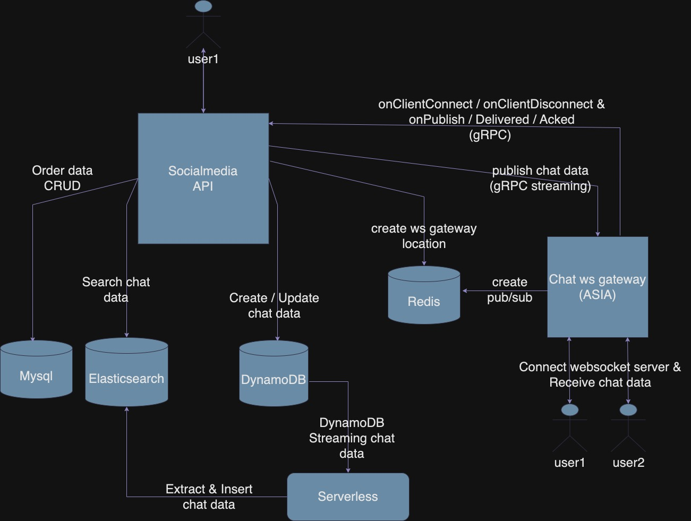

# Nestjs-Socialmedia

## Description

Implement social-media chat app by using nestjs, typescript, turborepo as monorepo and clean-architecture concept, etc. Please have fun and enjoy it. =)

## Socailmedia api use-case

### Users

1. create user - [POST] `{{BASE_URL}}/api/v1/users`
2. get me - [GET] `{{BASE_URL}}/api/v1/users/me`
3. get user - [GET] `{{BASE_URL}}/api/v1/users/:id`

### Channels

1. create channel - [POST] `{{BASE_URL}}/api/v1/channels`
2. get channel - [GET] `{{BASE_URL}}/api/v1/channels/:id`

### Members of channel

1. create member(join channel) - [POST] `{{BASE_URL}}/api/v1/members`

### Chats

1. create chat - [POST] `{{BASE_URL}}/api/v1/chats`
2. get chat - [GET] `{{BASE_URL}}/api/v1/chats/:id`
3. list chat - [GET] `{{BASE_URL}}/api/v1/chats`
4. remove chat - [DELETE] `{{BASE_URL}}/api/v1/chats/remove-multiple`
5. retract chat - [PUT] `{{BASE_URL}}/api/v1/chats/retract-multiple`
6. search chat - [GET] `{{BASE_URL}}/api/v1/chats-search`

## Chat ws gateway use-case

### Connect

1. clientid is clientid_${channel_id}
2. email is your user email

```shell
ws://localhost:3030/?clientid=clientid_${channel_id}&email=${email}
```

### Receive chat

1. after connecting the websocket connection with specifeid channel and end-user
2. use create chat api, then you can see the response from websocket server

### Disconnect

1. it will delete related resource suchas subscriptions from redis, etc.

### OnAck event

1. createdAt is creation of specified chat that client receive from gateway server
2. this process will callback to socialmedia api server to updat on acked at field

```json
{
    "event": "onAck",
    "data": {
        "channelId": 1,
        "createdAt": "2024-12-19T06:54:04.273Z"
    }
}
```

## Serverless use-case

1. Consuming dynamodb data from creating chat api, and bulk insert into elasticsearch for full-text feature

## System digram



## Environment setup

```shell
#cd root path

#install package
pnpm i

#build package
pnpm build

#root folder use docker-compsoe
docker-compose up -d

#check related adapters is running
#Mysql, Redis, Elasticsearch, Logstash, Kibana, Localstack(for DynamoDB, S3)
docker ps
```

### Knex for Mysql

```shell
#cd apps/socialmedia-api path

#init knex project
knex init -x ts

#Migration
#create file
knex migrate:make ${name} -x ts #name: is your file name

#up
knex migrate:up

#down
knex migrate:down

#Seed
#create file
knex seed:make ${name} #name: is your file name
```

### DynamoDB & DynamoDB stream

1. use [localstack](https://github.com/localstack/localstack) as dynamodb
2. use [awslocal](https://github.com/localstack/awscli-local) command

```shell
#create table and enable dynamodb stream
#table name is chats
awslocal dynamodb create-table \
    --table-name chats \
    --key-schema AttributeName=channel_id,KeyType=HASH AttributeName=created_at,KeyType=RANGE \
    --attribute-definitions AttributeName=channel_id,AttributeType=N AttributeName=created_at,AttributeType=S \
    --provisioned-throughput ReadCapacityUnits=5,WriteCapacityUnits=5 \
    --stream-specification StreamEnabled=true,StreamViewType=NEW_IMAGE \
    --region ap-east-1

#describe table
awslocal dynamodb describe-table --table-name chats --region ap-east-1
{
    #...
    "LatestStreamArn": "arn:aws:dynamodb:ap-east-1:000000000000:table/chats/stream/2024-12-23T05:46:08.897",
    #pleas set this stream arn to ./apps/serverless/serverless.yaml file
    #...
}

#delete table
awslocal dynamodb delete-table --table-name chats --region ap-east-1

#list tables
awslocal dynamodb list-tables --region ap-east-1

#DynamoDB stream
#list
awslocal dynamodbstreams list-streams

#describe
awslocal dynamodbstreams describe-stream --stream-arn arn:aws:dynamodb:ap-east-1:000000000000:table/chats/stream/2024-12-23T05:46:08.897
```

### S3

1. use [localstack](https://github.com/localstack/localstack) as s3
2. use [awslocal](https://github.com/localstack/awscli-local) command

```shell
#create bucket
awslocal s3api create-bucket --bucket ${bucket_name} --create-bucket-configuration LocationConstraint=ap-east-1
{
    "Location": "http://${bucket_name}.s3.localhost.localstack.cloud:4566/"
}

#delete
awslocal s3 rb s3://${bucket_name} --force

#list
awslocal s3api list-buckets
```

### Elasticsearch

```json
//create template
PUT /_index_template/chats-index-template
{
  "index_patterns" :["chats"],
  "priority" : 1,
  "template": {
    "settings" : {
      "number_of_shards" : 1
    },
    "mappings": {
      "properties": {
        "channel_id": {
          "type": "integer",
          "index": true
        },
        "created_at": {
          "type": "date",
          "index": true
        },
        "updated_at": {
          "type": "date"
        },
        "sender_id": {
          "type": "integer"
        },
        "text":    {
          "type": "text"
        },
        "is_retract": {
          "type": "boolean"
        },
        "ignored_user_ids": {
          "type": "integer"
        }
      }
    }
  }
}
```

## Running in local

```shell
#cd root path and start servers
#socialmedia-api(listen at 3000 port)
#chat-ws-gateway(listen at 3030)
pnpm dev

#cd ./apps/serverless path
#use serverless-offline
sls offline
```

## Doc

1. [serverless-offline-dynamodb-streams](https://www.npmjs.com/package/serverless-offline-dynamodb-streams)
2. [dynamodb streams](https://docs.aws.amazon.com/amazondynamodb/latest/developerguide/Streams.html)
3. [google-protobuf](https://www.npmjs.com/package/google-protobuf)
4. [javascript_dynamodb_code_examples](https://docs.aws.amazon.com/sdk-for-javascript/v3/developer-guide/javascript_dynamodb_code_examples.html)
5. [Expressions.UpdateExpressions](https://docs.aws.amazon.com/amazondynamodb/latest/developerguide/Expressions.UpdateExpressions.html)
6. [gRPC style guide](https://buf.build/docs/best-practices/style-guide/)
7. [gRPC style guide](https://protobuf.dev/programming-guides/style/)
8. [serverless-offline](https://www.serverless.com/plugins/serverless-offline)

## Todo

1. Media feature is unready.
   1. use s3 as media bucket
   2. use presigned url
2. Swagger document is unready.
3. The authorization of gRPC protocol is unimplemented.
4. The heart beat of websocket is unimplemented.
5. Delete specified channel api.
6. Leave specified channel api.
7. Publish chat failover solution.
8. Implement dispatcher server between socialmedia-api and chat-ws-gateway server.
9. Separate redis server to each microservice.
10. Add unit test.
11. Modify logger.
12. Probably ...
